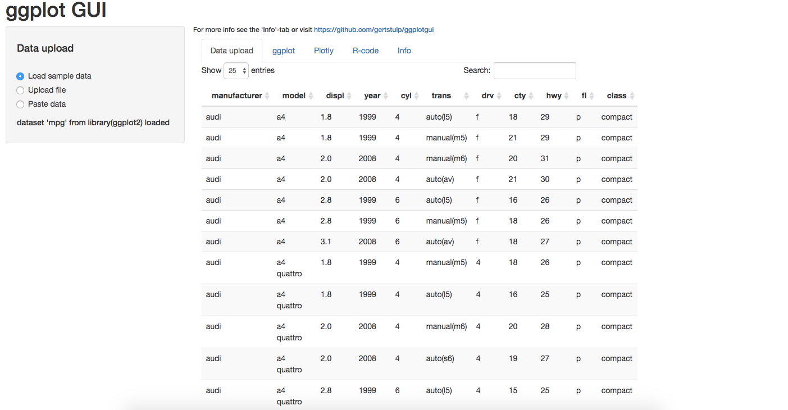
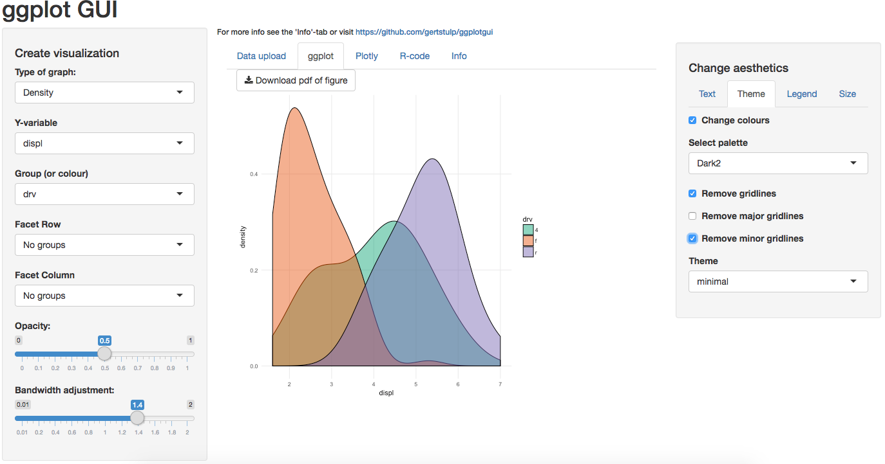
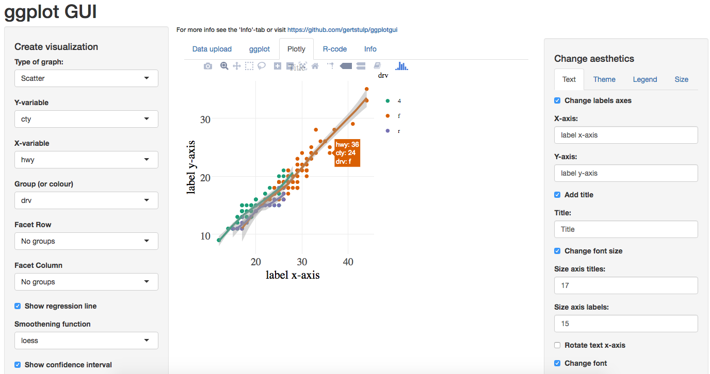
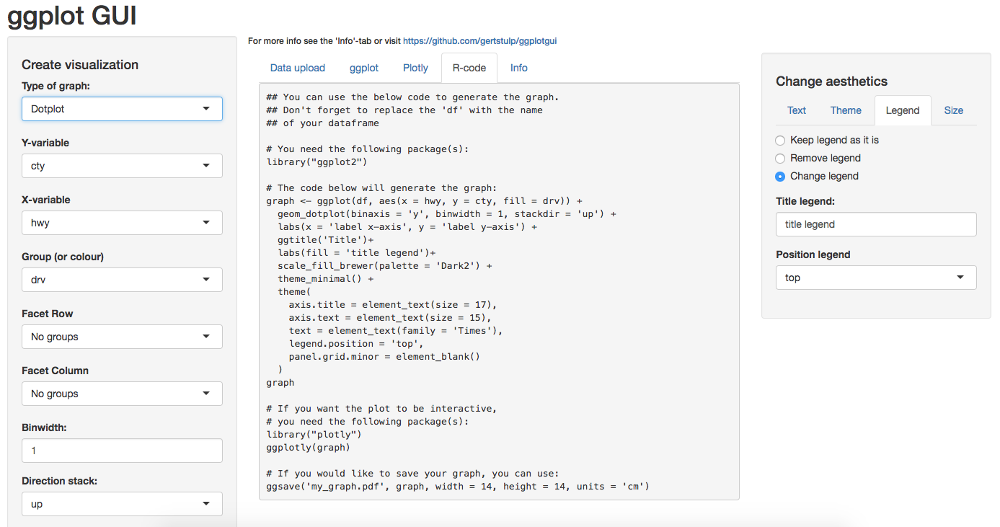

<!-- README.md is generated from README.Rmd. Please edit that file -->
ggplotgui
=========

[](https://travis-ci.org/gertstulp/ggplot.gui) [](https://CRAN.R-project.org/package=ggplot.gui) [](https://CRAN.R-project.org/package=ggplot.gui)

Quick overview
==============

This package allows users to visualize their data using an online graphical user interface (GUI) that makes use of [R](https://www.r-project.org/)'s visualization package [ggplot](http://ggplot2.org/). There are two ways of using this functionality: 1) online, where users can upload their data and visualize it without needing R, by visiting this link: ; 2) from within the R-environment (by using the ggplot.gui() function). In either case, R-code will be provided such that the user can recreate the graphs within the R-environment.

Background
==========

[R](https://www.r-project.org/) is amazing, but daunting for many. The programming style of R, compared to the point-and-click style of typical software, is a hurdle for many. Perhaps particularly so for those in the social sciences, whose statistical needs are often met by other software packages. Yet such packages are often very limited in terms of their options to visualize the data at hand. I believe that the amazing visualization-capabilities of R, might be one way to get more people to use it. To lower the barrier to start using R, this package allows users to visualize their data using an online graphical user interface (GUI) that makes use of R's visualization package [ggplot](http://ggplot2.org/). There are two ways of using this functionality: 1) online, where users can upload their data and visualize it without needing R, by visiting this link: ; 2) from within the R-environment (by using the ggplot.gui() function). Importantly, the R-code will also be provided such that the user can recreate the graphs within the R-environment. The main aim (or hope) is to get more people using R and its wonderful (graphing) capabilities.

Installation
============

``` r
# In order to install the package, you'll need to use the "devtools"-package
install.packages("devtools")
library("devtools")
devtools::install_github("gertstulp/ggplotgui")
library("ggplotgui")
```

Usage
=====

There are two ways to use this functionality:

-   By calling it from within R

``` r
# You can call the function with and without passing a dataset
ggplot_shiny()
ggplot_shiny(mpg) # Passing ggplot's mpg dataset
```

-   By using the following link:

This will open up the following screen: 

A ggplot-graph can be made through point and click: 

As well as an interactive version (through plotly): 

And importantly, R-code to recreate the graphs will be provided: 

Acknowledgements
================

I am grateful to the people who made [R](https://www.r-project.org/), and for [Hadley Wicham](http://hadley.nz/) for making such good packages (and open access books describing them), that allow even low-skilled and low-talented programmers like myself to be able to contribute to R. This package makes use of: [ggplot2](http://ggplot2.tidyverse.org/), [Shiny](http://shiny.rstudio.com/), [stringr](http://stringr.tidyverse.org/), and [plotly](https://plot.ly/r/). Package development through [RStudio](https://www.rstudio.com/) and [Github](https://github.com/), and with the help of [R Markdown](http://rmarkdown.rstudio.com) and [devtools](). The code that allows for online data input was copied (rather shamelessly) from the [BoxPlotR Shiny app](https://github.com/VizWizard/BoxPlotR.shiny).
